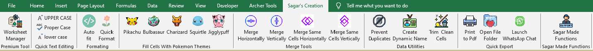

# Sagar_Creation

A powerful **all-in-one Excel VBA Add-in** designed to automate repetitive tasks, clean data instantly, manage worksheets visually, and apply professional or creative formatting — all from a custom Ribbon.

Built for users who **hate manual work** and prefer **smart Excel systems**.

---
## 📥 Download Add-in

🔽 **[Click here to download the Excel Add-in (.xlam)](https://raw.githubusercontent.com/sagardangar77/Sagar_Creation/addin/Sagar Creation V1.3.xlam)**

> After download:  
> Excel → File → Options → Add-ins → Browse → Select file → Restart Excel

## 📸 Screenshots

### 🔹 Custom Ribbon Interface

### 🔹 Sheet Manager (UserForm)  

### 🔹 How to use Custom Functions (UserForm)

---

## ✨ Features Overview

### 🧹 Data Cleaning & Text Tools
- Trim & Clean selected cells
- Convert to Proper Case / Uppercase / Lowercase
- Remove trailing numbers from text
- Merge cells horizontally or vertically with custom delimiters
- Smart merge for identical adjacent values

---

### 🔍 Custom Excel Functions (UDFs)
Works even in older Excel versions.

| Function | Description |
|--------|------------|
| `SD_CleanText()` | Remove numbers, letters, or special characters |
| `SD_IsBold()` | Detect if any character in a cell is bold |
| `SD_JOINTEXT()` | Join non-empty cells with a delimiter |
| `SD_MultiLookup()` | Return all matching lookup values |
| `SD_NthLookup()` | Fetch 1st, 2nd, 3rd… lookup match |
| `SD_NumberToWords()` | Convert numbers to words (Indian format) |
| `SD_RemoveTrailingNumbers()` | Clean text endings |

---

### 📂 Sheet Manager (Visual Tool)
- Live sheet search
- Add, rename, delete sheets
- Hide / unhide sheets
- Sort sheets A–Z or Z–A
- Move sheets up/down
- Toggle sheet tabs
- Consolidate multiple sheets into one
- Create clickable Table of Contents
- Copy selected sheets to a new workbook

---

### 🎨 Formatting & Automation
- One-click professional table formatting
- AutoFit columns on Enter key
- Negative number highlighting
- Alternate row shading
- Gridline removal
- Pokémon-inspired themes:
  - Pikachu
  - Bulbasaur
  - Charmander
  - Squirtle
  - Jigglypuff

---

### ⚙️ Productivity Utilities
- Save selected range as PDF
- Open active workbook folder
- Launch WhatsApp chat from phone number cell
- Prevent duplicate entries in a range
- Create dynamic named ranges automatically

---

## 🛠 Installation
1. Download the `.xlam` file from the **addin/** folder  
2. Open Excel → File → Options → Add-ins  
3. Click **Go** → **Browse** → Select the add-in  
4. Restart Excel  
5. Access tools from the **Custom Ribbon**

---

## 💡 Why This Add-in Exists
This add-in was built to:
- Eliminate boring manual Excel work
- Replace repeated formatting tasks
- Add missing Excel features
- Make Excel faster and more fun

---

## 👤 Author
**Sagar Dangar**  
Excel Automation & VBA Enthusiast  

> “I don’t like touching the mouse when Excel can do it for me.”

---

## 📜 License
Free for personal and educational use.
Commercial usage requires permission.
